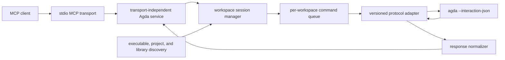

# Agda MCP Server: Initial Design

Status: draft for discussion  
Date: 2026-07-18  
Tested Agda baseline: 2.8.0

## 1. Purpose

Build a standalone TypeScript MCP server that exposes Agda's interactive
typechecking and proof-development operations to MCP clients. The server talks
directly to a long-lived `agda --interaction-json` subprocess and translates
between stable, normalized MCP schemas and Agda's editor-facing interaction
protocol.

The initial server is intentionally non-mutating: operations that would
normally cause an editor to change source text return proposed edits, but do
not write them to disk.

## 2. Decisions made

| Topic | Initial decision |
| --- | --- |
| Implementation | Standalone TypeScript process |
| Agda integration | Long-lived `agda --interaction-json` subprocess |
| MCP transport | `stdio` first |
| Internal API | Independent of MCP transport |
| Agda process count | One long-lived subprocess per active workspace |
| Loaded state | One top-level module per workspace |
| Concurrency | Serialized within a workspace; independent across workspaces |
| Source model | On-disk `.agda`, `.lagda`, and `.lagda.md` files |
| Transformations | Return proposed edits; never write files |
| Preview recovery | Reload the unchanged module after each transformation |
| Goal selection | Opaque goal handles only |
| Public results | Normalized objects with native Agda events in `raw` |
| Configuration | MCP initialization options plus `.agda-lib` discovery; no mandatory new config file |
| Version baseline | Agda 2.8.0, detected rather than hardcoded at runtime |
| Node.js baseline | Node.js 22 or newer; CI tests Node.js 22 and 24 |
| Package manager | npm with a committed `package-lock.json` |
| Distribution | Compiled ESM npm CLI package with an `agda-mcp` executable |
| Output budgets | 128 KiB raw return, 32 KiB stderr return, 16 MiB hard output per command |

## 3. Goals

- Load and typecheck an Agda top-level module.
- Retrieve goals, goal-local context, constraints, and metavariables.
- Propose edits for case splitting, refinement, and automatic proof search.
- Normalize an expression and infer an expression's type, either at top level
  or in a goal's local context.
- Keep Agda interaction state alive between calls.
- Detect stale files and stale goal handles before issuing a command.
- Preserve the native JSON event stream for diagnostics and compatibility.
- Rediscover the Agda executable, installation directories, and library
  configuration when the MCP server restarts.
- Isolate version-specific command encoding and response decoding.

## 4. Non-goals for the first version

- Directly modifying Agda source files.
- Supporting unsaved or virtual editor buffers.
- Keeping multiple top-level modules loaded in one workspace.
- Streamable HTTP transport.
- Sharing a workspace session between multiple MCP server processes.
- Exposing Agda's internal Haskell API.
- Guaranteeing compatibility with a future interaction protocol that has made
  breaking wire-format changes.
- Exposing internal typechecker state that Agda 2.8.0 does not publish through
  its interaction responses.

## 5. High-level architecture



### 5.1 Boundaries

`McpTransport` maps MCP tool calls and cancellation into application requests.
It owns no Agda semantics. A future HTTP transport should be able to reuse the
same service.

`AgdaService` exposes typed application operations such as `loadModule`,
`getContext`, and `previewRefine`. It returns transport-neutral domain objects.

`WorkspaceSessionManager` resolves workspace identity and owns the session map.
Each `WorkspaceSession` owns one child process, one loaded module, one command
queue, and the current goal-handle table.

`AgdaProtocolAdapter` encodes `IOTCM` commands and decodes Agda events for a
protocol/version family. The first concrete adapter targets Agda 2.8.0.

`ResponseNormalizer` folds a native event sequence into stable domain objects.
Unknown events and fields remain in `raw`.

`EditPlanner` converts `GiveAction` and `MakeCase` responses into text edits
against the exact source snapshot used for the command.

## 6. Workspace and executable discovery

### 6.1 Workspace selection

Every module-loading request supplies an absolute source path. The server:

1. Resolves symlinks for both the source path and configured MCP workspace roots.
2. Rejects a source file outside all configured roots.
3. Walks upward from the source file to find the nearest `.agda-lib` file.
4. Uses that file's directory as the Agda project root.
5. Falls back to the containing MCP workspace root if there is no `.agda-lib`.

The initial source-format allowlist is case-sensitive and accepts `.agda`,
`.lagda`, and `.lagda.md`, checking the compound `.lagda.md` suffix before the
shorter suffixes. Agda itself performs literate preprocessing. Source
fingerprints and normalized positions refer to the complete original file,
including prose and code-block delimiters.

Format-aware edit planning must preserve literate structure:

- `.agda` edits target ordinary Agda clauses and holes.
- `.lagda` edits stay inside the relevant `\begin{code}` / `\end{code}` region.
- `.lagda.md` edits stay inside the relevant fenced Agda code block and preserve
  its fence and surrounding prose.

All read/query tools work for every supported format. If a transformation
response cannot be mapped safely to one code region, the server returns
`UNSUPPORTED_EDIT_SHAPE` instead of proposing a potentially destructive edit.

The canonical project root is the workspace-session key. Imported registered
libraries may live outside the workspace, but they cannot become direct tool
targets unless explicitly configured as workspace roots.

### 6.2 Agda configuration

Configuration comes from MCP server initialization options. Suggested fields:

```ts
interface ServerOptions {
  agdaExecutable?: string;       // default: resolve `agda` from PATH
  includePaths?: string[];
  libraries?: string[];
  libraryFile?: string;
  additionalFlags?: string[];
  commandTimeoutMs?: number;
  rawResponseLimitBytes?: number;    // default: 131072 (128 KiB)
  stderrReturnLimitBytes?: number;   // default: 32768 (32 KiB)
  maxCommandOutputBytes?: number;    // default: 16777216 (16 MiB)
  allowAgdaExec?: boolean;       // default: false
}
```

Workspace-specific overrides can be added without changing the service API.
There is no required `agda-mcp.json` in the first version.

The nearest `.agda-lib` supplies its relative include directories,
dependencies, and flags. Explicit initialization options take precedence where
they conflict. Command arguments are passed as an argument vector and encoded
as Agda command data; they are never evaluated by a shell.

### 6.3 Restart and version upgrades

Resolved installation paths are never persisted. On server startup, and before
creating the first workspace session, the server:

1. Resolves the configured executable or `agda` from the current `PATH`.
2. Runs `agda --numeric-version`.
3. Runs `agda --print-agda-app-dir`.
4. Runs `agda --print-agda-data-dir`.
5. Selects a protocol adapter.
6. Starts workspace processes only when first needed.

Agda remains responsible for interpreting its current `libraries` and
`defaults` files in the current Agda application directory. The MCP server does
not cache paths from those files. Thus an installation relocation normally
requires only an MCP server restart, provided Agda's own library registry is
valid.

Agda 2.8.0 is the tested baseline, not a runtime executable-path pin. An exact
2.8.0 match is reported as `supported`. An unknown version initially uses the
2.8.0 adapter in `unverified` compatibility mode and emits a warning in server
and load results. If command parsing or a required response shape has changed,
the affected call fails with `UNSUPPORTED_AGDA_PROTOCOL`; a new adapter is then
required. Unknown fields alone do not cause failure.

## 7. Agda subprocess protocol

Each workspace subprocess runs:

```text
agda --interaction-json
```

Project options are supplied through the interaction load command. Commands
use Agda's textual `IOTCM` input format with JSON output, for example:

```text
IOTCM "/absolute/path/Module.agda" None Direct
  (Cmd_load "/absolute/path/Module.agda" [])
```

Protocol strings must be encoded by a dedicated Haskell-string encoder. Plain
string interpolation is not sufficient for quotes, backslashes, control
characters, or Unicode.

Agda's protocol does not correlate commands with request IDs. Consequently:

- Only one command may be in flight in a workspace process.
- The adapter collects JSON events until the next `JSON>` prompt.
- Prompt recognition must work even if a prompt and the next event share a
  physical output line.
- Non-JSON stdout fragments and stderr are captured as diagnostics and never
  forwarded to the MCP server's stdout.
- The MCP process reserves stdout exclusively for MCP framing and uses stderr
  for its own logs.

The 2.8.0 adapter uses `Direct` JSON responses and `None` highlighting unless a
future tool explicitly requires highlighting data.

## 8. State and identity

Conceptually, a workspace session contains:

```ts
interface WorkspaceSession {
  workspaceId: string;
  workspaceHandle: string;
  root: string;
  process: AgdaProcess;
  activeModule?: string;
  revision: number;
  sourceFingerprint?: string;
  goals: Map<string, GoalRecord>;
  queue: SerializedCommandQueue;
  lifecycle: "starting" | "ready" | "recovering" | "stopped";
}
```

The source fingerprint is a SHA-256 digest of the exact bytes used by the most
recent successful load attempt. Goal records include the Agda interaction-point
ID, source range, module path, revision, and source fingerprint.

### 8.1 Workspace handles

`agda_load_module` returns an opaque workspace handle. Module-level tools use
this handle to select the active session unambiguously in multi-root clients.
The handle remains stable for the lifetime of the MCP server process, while the
workspace revision changes after every reload or recovery.

### 8.2 Opaque goal handles

A goal handle is an unguessable token backed by a server-side table. Clients do
not see or provide bare Agda interaction-point IDs. A handle is valid only when:

- its workspace session still exists;
- its module is still the active module;
- its revision equals the current revision;
- the source fingerprint still matches; and
- its interaction point is still present.

Loading another module, reloading, recovering a process, or completing a
transformation preview invalidates all existing handles. Stale use fails with
`STALE_GOAL_HANDLE` and does not reach Agda.

### 8.3 External source changes

Before every stateful command other than `load_module` or `typecheck`, the
server recomputes the active module's fingerprint. A mismatch returns
`SOURCE_CHANGED` and instructs the client to call `load_module` or `typecheck`.
This check is repeated immediately before a proposed edit is returned.

## 9. Common normalized types

The exact TypeScript definitions can evolve, but the public concepts should be
stable:

```ts
type WorkspaceHandle = string;
type GoalHandle = string;

interface SourcePosition {
  line: number;          // 1-based
  column: number;        // 1-based, normalized from Agda's reported position
  utf16Offset: number;   // 0-based offset in the loaded source snapshot
}

interface SourceRange {
  start: SourcePosition;
  end: SourcePosition;
}

interface GoalSummary {
  handle: GoalHandle;
  range: SourceRange;
  type: string;
}

interface MetavariableSummary {
  handle?: GoalHandle;   // present only for an actionable interaction goal
  range?: SourceRange;
  type: string;
  visibility: "visible" | "invisible";
}

interface ContextEntry {
  originalName?: string;
  reifiedName: string;
  type: string;
  inScope: boolean;
}

interface TextEdit {
  file: string;
  range: SourceRange;
  replacement: string;
  expectedSourceFingerprint: string;
}

interface CapturedStderr {
  chunks: string[];
  complete: boolean;
  capturedBytes: number;
  totalBytes: number;
}

interface RawCommandTranscript {
  events: unknown[];
  complete: boolean;
  capturedBytes: number;
  totalBytes: number;
  omittedEventCount: number;
  omittedSha256?: string;
  stderr: CapturedStderr;
}

interface RawAgdaResponse extends RawCommandTranscript {
  adapter: string;
  restore?: RawCommandTranscript;
}

interface NormalizedResult<T> {
  data: T;
  warnings: string[];
  raw: RawAgdaResponse;
}
```

`raw` is present on every successful tool result. For a cached value, `raw`
contains the latest native event sequence that established that value. The
initial retrieval tools should generally query Agda rather than rely on cache,
so callers receive a fresh native response.

### 9.1 Raw-response budgets

Two independent limits are required:

- A soft return budget limits how much native output is copied into the MCP
  result's `raw` field. Crossing it does not invalidate the normalized result.
  The server returns complete JSON events that fit the budget and marks `raw`
  as incomplete with captured/total byte counts, omitted event count, and a
  digest of omitted bytes.
- A larger hard command-output limit protects the server from a runaway or
  unexpectedly huge Agda response. Crossing it aborts the command and returns
  `OUTPUT_LIMIT_EXCEEDED`, because the complete event stream was not available
  for normalization.

stderr has its own soft return budget. Transformation operation and restore
commands each receive their own budgets so a large proposal cannot hide the
restore transcript. The initial defaults per Agda command are:

- 128 KiB of complete native JSON events returned in `raw`;
- 32 KiB of stderr returned in `raw.stderr`; and
- 16 MiB of aggregate child output as the hard safety limit.

These values are overridable initialization policy rather than adapter
behavior. A transformation and its restoration reload are separate Agda
commands, so each receives a separate budget.

Ranges carry both human-readable line/column values and an offset computed
against the immutable loaded snapshot. This avoids asking clients to reproduce
Agda's Unicode position accounting. Agda's original range remains unchanged in
the corresponding raw event.

## 10. Initial MCP tools

Tool names use an `agda_` prefix to remain clear when a client has tools from
several MCP servers.

### 10.1 `agda_server_info`

Returns the resolved executable, detected version, application/data directories,
selected adapter, compatibility status, configured workspace roots, and current
workspace-session summaries. It does not start every possible workspace
session.

### 10.2 `agda_load_module`

Input:

```ts
{ modulePath: string }
```

Requires an absolute on-disk source path. It resolves the workspace, lazily
starts its Agda process, and sends `Cmd_load`. Loading necessarily typechecks in
Agda. The call establishes this file as the workspace's sole active top-level
module, increments the revision, and invalidates previous handles even when the
same path is reloaded.

The result contains an opaque workspace handle, workspace identity, module
path, revision, source fingerprint, checked status, normalized diagnostics and
warnings, visible goals, invisible metavariables, new goal handles,
version/adapter information, and raw events.

Type errors are normal tool data (`checked: false` plus diagnostics), not MCP
transport errors.

Agda 2.8.0 mapping:

```text
Cmd_load <absolute-module-path> <resolved-arguments>
```

### 10.3 `agda_typecheck`

Input:

```ts
{ workspace: WorkspaceHandle }
```

Forces the active module through the same load/typecheck cycle as
`agda_load_module`. It exists as an explicit convenience tool and returns the
same core result shape. It fails with `NO_ACTIVE_MODULE` if the selected
workspace has not loaded a module.

### 10.4 `agda_retrieve_goals`

Input is `{ workspace: WorkspaceHandle }`, with no goal. It sends `Cmd_metas AsIs`
and projects the response to visible interaction goals, with opaque handles,
ranges, types, and the current revision.

### 10.5 `agda_retrieve_context`

Input:

```ts
{
  goal: GoalHandle;
  rewrite?: "as_is" | "simplified" | "instantiated" | "normalised" | "head_normal";
}
```

Returns the goal type, ordered local context entries, boundary information when
published by Agda, and raw events. It maps to `Cmd_goal_type_context` (or the
equivalent `Cmd_context` projection in a later adapter).

### 10.6 `agda_retrieve_constraints`

Input is `{ workspace: WorkspaceHandle }`. It queries the active module with
`Cmd_constraints`. It returns normalized constraint records and their rendered
Agda text. Where Agda does not publish a structured component, the normalized
record retains the rendered form and points to the full native value in `raw`.

### 10.7 `agda_case_split`

Input:

```ts
{
  goal: GoalHandle;
  variables?: string; // empty means split on the result
}
```

Maps to `Cmd_make_case`. Agda 2.8.0 returns a `MakeCase` event containing a
variant and replacement clauses. `EditPlanner` derives the enclosing clause or
extended-lambda range from the validated source snapshot and returns one or
more proposed `TextEdit` values. No edit is applied.

### 10.8 `agda_refine`

Input:

```ts
{
  goal: GoalHandle;
  expression?: string;
  usePatternLambda?: boolean;
}
```

Maps to `Cmd_refine_or_intro`. An omitted or empty expression permits Agda's
intro/single-constructor refinement behavior. A `GiveAction` becomes a proposed
edit replacing the goal range. No edit is applied.

### 10.9 `agda_auto`

Input:

```ts
{
  goal: GoalHandle;
  query?: string;
}
```

Maps to Agda 2.8.0's `Cmd_autoOne AsIs`, described by Agda's editor mode as
simple proof search. A successful `GiveAction` becomes a proposed edit. Failure
to find a proof is returned as a normalized unsuccessful search result, not as
a process failure.

### 10.10 `agda_normalize_expression`

Input:

```ts
{
  expression: string;
  workspace?: WorkspaceHandle;
  goal?: GoalHandle;
  mode?: "default" | "ignore_abstract" | "head" | "use_show_instance";
}
```

Exactly one of `workspace` or `goal` is required. With a goal, the expression is
interpreted in that goal's local context and maps to `Cmd_compute`. With a
workspace, it uses that workspace's active module top-level scope and maps to
`Cmd_compute_toplevel`. The default mode is `default`.

### 10.11 `agda_infer_type`

Input:

```ts
{
  expression: string;
  workspace?: WorkspaceHandle;
  goal?: GoalHandle;
  rewrite?: "as_is" | "simplified" | "instantiated" | "normalised" | "head_normal";
}
```

Exactly one of `workspace` or `goal` is required. With a goal, the command maps
to `Cmd_infer`; with a workspace, it maps to `Cmd_infer_toplevel` in that
workspace's active module. The result contains the rendered inferred type and
any structured information Agda publishes. The default rewrite mode is
`simplified`.

### 10.12 `agda_query_metavariables`

Input is `{ workspace: WorkspaceHandle }`. It queries `Cmd_metas AsIs` and
returns both visible and invisible metavariable records published by Agda.
Visible interaction metas also carry goal handles.

This tool cannot promise every internal typechecker metavariable: its scope is
exactly the information Agda exposes through the 2.8.0 interaction backend.
This limitation is reported in server capabilities.

## 11. Non-mutating transformation transactions

`case_split`, `refine`, and `auto` are treated as state-mutating commands even
if a particular Agda version appears not to mutate state for one of them.

Every transformation executes as a transaction under the workspace queue:

1. Validate the opaque goal handle.
2. Re-read and fingerprint the active source file.
3. Reject the request if the fingerprint differs from the loaded snapshot.
4. Send the interaction command and collect events to the next prompt.
5. Normalize the proposal against the source snapshot.
6. Re-read the source and reject the proposal if it changed during the command.
7. Immediately send `Cmd_load` for the unchanged active module.
8. Collect and normalize the restored state.
9. Increment the revision and invalidate every old goal handle.
10. Return proposed edits, restored diagnostics/goals, new handles, and both the
    operation and restore event streams.

Conceptual result:

```ts
interface EditProposalResult {
  edits: TextEdit[];
  restoredRevision: number;
  restoredGoals: GoalSummary[];
  diagnostics: Diagnostic[];
  sourceFingerprint: string;
}
```

If the proposal command fails after reaching Agda, the server still attempts
the reload. If reload fails, it kills the process, invalidates the session, and
returns `RESTORE_FAILED` with captured raw events. It must not return an edit as
safe to apply when canonical state could not be restored.

This model intentionally incurs one reload/typecheck and invalidates goal
handles after each preview. It keeps the primary process aligned with disk and
avoids temporary shadow files or secondary Agda processes.

## 12. Concurrency, cancellation, and recovery

- Calls for one workspace enter a FIFO queue.
- Calls for different workspaces may run concurrently.
- Loading a different module is an exclusive state transition in that
  workspace.
- A queued MCP request can be cancelled before it starts.
- For an active request, the process host first attempts Agda's abort command.
- If abort does not complete within a short grace period, the process is
  terminated and restarted.
- Restart invalidates all goal handles and increments the revision.
- If the active source still has its expected fingerprint, recovery may reload
  it automatically; otherwise the session remains unloaded.

Suggested configurable defaults are 120 seconds for load/typecheck, 30 seconds
for ordinary queries, and 60 seconds for proof transformations. These values
should remain policy, not be embedded in the protocol adapter.

## 13. Error model

Application errors use stable codes and include recoverability guidance:

| Code | Meaning |
| --- | --- |
| `INVALID_ARGUMENT` | Invalid path, expression, option, or empty required value |
| `PATH_OUTSIDE_WORKSPACE` | Direct source target is not in an allowed root |
| `AGDA_NOT_FOUND` | Executable resolution failed |
| `NO_ACTIVE_MODULE` | Operation requires a loaded module |
| `UNKNOWN_WORKSPACE` | Workspace handle is invalid or belongs to an earlier server process |
| `STALE_GOAL_HANDLE` | Handle does not belong to the current revision/state |
| `SOURCE_CHANGED` | On-disk source no longer matches the loaded snapshot |
| `UNSUPPORTED_EDIT_SHAPE` | Agda's proposed edit cannot be mapped safely to the source format |
| `AGDA_COMMAND_REJECTED` | Agda rejected or could not parse the command |
| `UNSUPPORTED_AGDA_PROTOCOL` | Required command or response shape is incompatible |
| `COMMAND_TIMEOUT` | Command exceeded its policy timeout |
| `PROCESS_EXITED` | Agda terminated unexpectedly |
| `OUTPUT_LIMIT_EXCEEDED` | Child output exceeded the configured safety limit |
| `RESTORE_FAILED` | Transformation preview could not restore canonical state |

Agda type errors, unsolved goals, warnings, and failed proof search are domain
results rather than MCP protocol errors whenever Agda completed the command
normally.

## 14. Security and safety

- The initial server never writes source files.
- Canonical real paths are checked against configured workspace roots.
- Child processes are spawned without a shell.
- Interaction strings use a dedicated encoder rather than interpolation.
- Source fingerprints prevent edits from being proposed against stale text.
- `--allow-exec` is rejected from project/config flags unless explicitly
  enabled by server initialization. Agda's default remains no external
  execution.
- Agda stdout is parsed as untrusted data and is never evaluated.
- Raw output has a configurable byte/event limit. Exceeding the limit aborts
  the command only at the hard safety limit; the smaller return budget merely
  marks the `raw` field as incomplete.
- Logs avoid source contents and expressions by default; debug logging is
  opt-in and goes to stderr.

## 15. Runtime, packaging, and source layout

### 15.1 Runtime and distribution

The package targets Node.js 22 or newer:

```json
{
  "type": "module",
  "engines": {
    "node": ">=22"
  },
  "bin": {
    "agda-mcp": "./dist/index.js"
  }
}
```

TypeScript compiles to ESM in `dist/`. The executable entry point has a Node
shebang and is included in the published npm package with its executable bit
set. Users can invoke it through `npx`, `npm exec`, or a global npm install.
The final npm package name may be unscoped or scoped, but the executable remains
`agda-mcp`.

npm is the development and release package manager. The repository commits
`package-lock.json`; CI and release builds use `npm ci`. The CI compatibility
matrix runs tests on the latest Node.js 22 and 24 releases.

The npm package does not bundle Agda. At runtime it discovers an external Agda
installation using the policy in section 6.3. Self-contained platform
executables and container images are deferred distribution channels.

### 15.2 Suggested source layout

```text
src/
  index.ts
  mcp/
    stdioServer.ts
    toolSchemas.ts
  application/
    agdaService.ts
    domain.ts
    errors.ts
  discovery/
    agdaInstallation.ts
    projectResolver.ts
    agdaLib.ts
  sessions/
    workspaceSession.ts
    sessionManager.ts
    commandQueue.ts
    goalHandles.ts
  protocol/
    processHost.ts
    streamParser.ts
    stringEncoder.ts
    adapter.ts
    adapters/
      agda-2.8.0.ts
  normalization/
    responses.ts
    ranges.ts
    sourceFormats.ts
    editPlanner.ts
test/
  fixtures/agda-2.8.0/
  unit/
  integration/
```

## 16. Testing strategy

### Unit tests

- Haskell-string command encoding, including Unicode and control characters.
- Prompt/event stream parsing across arbitrary chunk boundaries.
- Preservation of unknown events in `raw`.
- Soft raw/stderr truncation metadata and hard output-limit abort behavior.
- 1-based Agda ranges to UTF-16 snapshot offsets.
- Goal-handle validation and invalidation.
- `.agda-lib` and workspace discovery.
- Normalization of success, type error, warning, and malformed responses.
- `GiveAction` and `MakeCase` edit planning.
- Format-aware range and edit planning for `.agda`, `.lagda`, and `.lagda.md`.

### Transcript contract tests

Store sanitized 2.8.0 JSON transcripts for load, goals, context, constraints,
case split, refine, auto, normalization, inference, and metas. Replay them
against the normalizer so schema regressions do not require an Agda process.

### Agda integration tests

- Verify the test binary reports Agda 2.8.0 for baseline tests.
- Load a small module containing visible and invisible metas.
- Load equivalent plain, literate TeX, and literate Markdown modules.
- Assert that every tool produces normalized data and preserves raw events.
- Confirm `refine` and `auto` mutate the backend before restoration.
- Confirm reload-after-preview restores the original goals and returns new
  handles.
- Confirm case-split/refine edits preserve literate code delimiters and prose.
- Modify a file between load and command and expect `SOURCE_CHANGED`.
- Exercise two workspace processes concurrently while commands within each
  remain serialized.
- Kill and hang a child process to test recovery and cancellation.

### MCP integration tests

Launch the built server over stdio, perform MCP initialization, list tools, and
call every tool. Assert that no Agda output corrupts MCP stdout framing.

## 17. Implementation phases

1. Scaffold the Node.js 22 TypeScript ESM package with npm, domain types, stdio
   transport, discovery, and `agda_server_info`.
2. Implement the process host, stream parser, 2.8.0 adapter, workspace sessions,
   `agda_load_module`, `agda_typecheck`, and goal handles.
3. Add goals, context, constraints, metas, normalization, and type inference.
4. Add edit planning and reload-after-preview transactions for case split,
   refine, and auto.
5. Add cancellation, recovery, output limits, transcript fixtures, and full MCP
   integration tests.
6. Document installation and client configuration, then package the stdio
   executable.

## 18. Deferred extensions

- An explicitly enabled file-mutation layer that applies a proposal only when
  its expected source fingerprint still matches, then typechecks the result.
- Streamable HTTP implemented as another `McpTransport`.
- Multiple loaded module states per workspace.
- Unsaved buffer support using explicitly managed temporary snapshots.
- Additional Agda interaction commands such as give, solve, module contents,
  search, highlighting, or why-in-scope.
- Adapters and recorded transcripts for additional Agda versions.
