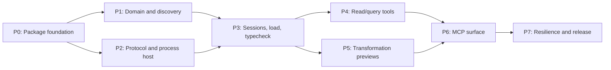

# Agda MCP Server: Implementation Plan

Status: ready for implementation  
Date: 2026-07-18  
Source design: [DESIGN.md](./DESIGN.md)  
Tested Agda baseline: 2.8.0

## 1. Delivery strategy

Implement the server in vertical, independently testable slices. Keep Agda
protocol code, application semantics, and MCP transport separate from the
start. Every phase ends with an acceptance gate; later phases should not build
on an unverified protocol or state model.

The first releasable version is complete only when all twelve MCP tools work
over stdio against Agda 2.8.0, transformations restore canonical state, and
the packed npm CLI passes an end-to-end installation test.

### 1.1 Fixed constraints

- Node.js 22 or newer; CI runs Node.js 22 and 24.
- TypeScript compiled to ESM.
- npm and a committed `package-lock.json`.
- `stdio` MCP transport with stdout reserved exclusively for MCP framing.
- One long-lived `agda --interaction-json` process per active workspace.
- One loaded top-level module per workspace.
- On-disk `.agda`, `.lagda`, and `.lagda.md` files only.
- Non-mutating edit proposals with reload-after-preview restoration.
- Normalized results plus native response events in `raw`.
- Default per-command budgets: 128 KiB raw, 32 KiB stderr, 16 MiB hard output.

### 1.2 Dependency order

P1 and P2 can be developed concurrently once P0 is complete. P4 and the
format-independent portions of P5 can also proceed concurrently after P3.

## 2. Phase summary

| Phase | Primary result | Acceptance gate |
| --- | --- | --- |
| P0 | Buildable Node/TypeScript npm CLI skeleton | Clean install, build, test, and executable smoke test on Node 22/24 |
| P1 | Domain model, configuration, Agda/project discovery | Deterministic discovery and security-policy unit tests pass |
| P2 | Agda protocol codec, stream parser, process host | Recorded and live 2.8.0 command round trips pass without framing leaks |
| P3 | Workspace sessions, loading, typechecking, handles | Plain and literate modules load with correct goals and stale-state checks |
| P4 | All read/query application operations | Goals, context, constraints, metas, normalize, and infer pass transcript/live tests |
| P5 | Safe case-split/refine/auto previews | Edits are proposed, files remain unchanged, state reloads, old handles become stale |
| P6 | Complete stdio MCP tool surface | SDK client lists and invokes all twelve tools end to end |
| P7 | Recovery, limits, packaging, release readiness | Fault tests and packed-tarball installation test pass on the CI matrix |

## 3. P0 — Package foundation

### 3.1 Repository scaffold

- [x] Create `package.json` with `type: module`, `engines.node: ">=22"`, and an
  `agda-mcp` `bin` entry pointing to `dist/index.js`.
- [x] Add TypeScript in strict mode with Node ESM/NodeNext module resolution.
- [x] Add a Node shebang to the CLI source and ensure the built entry is
  executable in the npm package.
- [x] Add npm scripts for `build`, `typecheck`, `test`, `test:integration`,
  `start`, and `prepack`.
- [x] Use Node's built-in test runner against compiled test output to minimize
  runtime dependencies.
- [x] Add `.gitignore` entries for `node_modules`, `dist`, coverage, temporary
  test output, and Agda interface/build artifacts.
- [x] Create the source and test directories from the design.
- [x] Add a minimal README describing that Agda is an external prerequisite.

### 3.2 CI baseline

- [x] Add CI jobs for the latest Node.js 22 and 24 releases.
- [x] Run `npm ci`, typechecking, unit tests, integration tests when Agda 2.8.0
  is available, build, and `npm pack --dry-run`.
- [x] Make Agda-dependent tests report a clear skip outside the baseline job,
  rather than silently passing.

### 3.3 P0 acceptance gate

- `npm ci`, `npm run typecheck`, `npm test`, and `npm run build` succeed.
- `node dist/index.js --help` exits successfully without writing protocol noise
  to stdout.
- The generated tarball contains the CLI, runtime files, README, and package
  metadata, but not tests or temporary artifacts.

## 4. P1 — Domain model, configuration, and discovery

### 4.1 Transport-neutral domain

- [x] Define normalized source positions/ranges, diagnostics, goals,
  metavariables, context entries, constraints, text edits, and result envelopes.
- [x] Define `RawCommandTranscript`, truncation metadata, restore transcripts,
  and captured stderr types.
- [x] Define stable application errors and codes from the design.
- [x] Define the transport-independent `AgdaService` interface containing all
  twelve operations.
- [x] Keep MCP SDK types out of `application/`, `discovery/`, `sessions/`,
  `protocol/`, and `normalization/`.

### 4.2 Configuration

- [x] Parse and validate MCP initialization options.
- [x] Apply defaults for executable resolution, timeouts, output budgets, and
  `allowAgdaExec: false`.
- [x] Reject invalid, negative, or internally inconsistent limits before
  starting a child process.
- [x] Model workspace overrides without introducing a mandatory project config
  file.

### 4.3 Agda installation discovery

- [x] Resolve an explicit executable or `agda` from the current `PATH` on each
  MCP server start.
- [x] Probe `--numeric-version`, `--print-agda-app-dir`, and
  `--print-agda-data-dir` without a shell.
- [x] Return an exact 2.8.0 compatibility status or an `unverified` warning for
  another detected version.
- [x] Never persist resolved installation or library locations across runs.

### 4.4 Workspace and project discovery

- [x] Canonicalize workspace roots and target paths with `realpath`.
- [x] Match `.lagda.md` before `.lagda` and `.agda`; reject other direct targets.
- [x] Find the nearest ancestor `.agda-lib`, otherwise use the containing MCP
  workspace root.
- [x] Parse `.agda-lib` name, include, depend, and flags fields needed to build
  `Cmd_load` arguments.
- [x] Resolve relative includes against the `.agda-lib` directory.
- [x] Merge project values with initialization overrides deterministically.
- [x] Reject `--allow-exec` unless the server was initialized with explicit
  authorization.
- [x] Allow registered imports outside the workspace while rejecting direct
  tool targets outside configured roots.

### 4.5 P1 tests and gate

- Unit-test extension matching, nested `.agda-lib` selection, symlink escapes,
  include resolution, precedence, malformed config, and unsafe flags.
- Probe the installed Agda and assert the expected local 2.8.0 values in the
  baseline integration job.
- Gate: the discovery layer returns a complete immutable launch/load plan for
  an allowed module without spawning the interaction process.

## 5. P2 — Protocol codec and process host

### 5.1 Command encoding

- [x] Implement and exhaustively test a Haskell string-literal encoder for
  quotes, slashes, control characters, newlines, and Unicode.
- [x] Define a version-neutral command model and an `AgdaProtocolAdapter`
  interface.
- [x] Implement the Agda 2.8.0 encodings for:
  - `Cmd_load`
  - `Cmd_metas`
  - `Cmd_goal_type_context`
  - `Cmd_constraints`
  - `Cmd_make_case`
  - `Cmd_refine_or_intro`
  - `Cmd_autoOne`
  - `Cmd_compute` and `Cmd_compute_toplevel`
  - `Cmd_infer` and `Cmd_infer_toplevel`
  - `Cmd_abort`
- [x] Wrap commands in `IOTCM <file> None Direct ...` without shell quoting.

### 5.2 Streaming response parser

- [x] Parse arbitrary stdout chunk boundaries incrementally.
- [x] Recognize `JSON>` only between protocol messages, not inside JSON strings.
- [x] Handle a prompt and the next JSON event sharing one physical line.
- [x] Parse each native JSON object without evaluating it.
- [x] Preserve unknown events and unknown fields.
- [x] Capture non-JSON stdout fragments and stderr as diagnostics.
- [x] Stream byte counts and omission digests without retaining output above the
  soft return budgets.
- [x] Enforce 128 KiB raw and 32 KiB stderr soft defaults at complete-event
  boundaries.
- [x] Enforce the 16 MiB aggregate hard limit even for a single unterminated
  event or stderr flood.

### 5.3 Process host

- [x] Spawn `agda --interaction-json` with `shell: false` and the workspace root
  as its working directory.
- [x] Capture child stdout/stderr; never pipe either stream to MCP stdout.
- [x] Expose start, send-one-command, abort, terminate, and exit-notification
  operations.
- [x] Guarantee exactly one active command per process.
- [x] Associate command completion with the next recognized prompt.
- [x] Return raw transcript and typed protocol failures.

### 5.4 Protocol fixtures

- [x] Capture sanitized Agda 2.8.0 transcripts for every required command.
- [x] Store inputs and native output events separately so encoding and decoding
  can be tested independently.
- [x] Include success, type error, warning, empty constraint, failed search,
  malformed command, and unknown-event fixtures.

### 5.5 P2 tests and gate

- Run the stream parser over every possible split point for representative
  transcripts.
- Test prompts embedded in JSON string values, oversized events, stderr floods,
  early EOF, invalid JSON, and unexpected child exit.
- Gate: a live process loads a tiny module and returns a complete raw event
  transcript without corrupting the parent process stdout.

## 6. P3 — Sessions, loading, typechecking, and handles

### 6.1 Session state

- [x] Implement `WorkspaceSessionManager`, keyed by canonical project root.
- [x] Create workspace handles that remain stable for the MCP process lifetime.
- [x] Lazily start one Agda process per active workspace.
- [x] Implement a FIFO serialized command queue per workspace.
- [x] Store one active module path, source snapshot, SHA-256 fingerprint,
  revision, current goals, and lifecycle state.
- [x] Invalidate state cleanly when another module is loaded in the workspace.

### 6.2 Goal handles

- [x] Create unguessable goal handles backed by a server-side table.
- [x] Bind each handle to workspace, module, revision, fingerprint,
  interaction-point ID, and source range.
- [x] Reject stale or foreign handles before sending anything to Agda.
- [x] Revoke all goal handles on reload, module switch, recovery, and completed
  transformation preview.

### 6.3 Load normalization

- [x] Normalize `Status`, `DisplayInfo`, `InteractionPoints`, warnings, errors,
  visible goals, and invisible metas from 2.8.0 events.
- [x] Convert Agda positions into 1-based line/column plus a zero-based UTF-16
  offset against the complete source snapshot.
- [x] Treat Agda type errors and unsolved goals as completed domain results.
- [x] Preserve every native event that fits the raw budget.

### 6.4 First vertical MCP slice

- [x] Implement `agda_server_info` in the application service.
- [x] Implement `agda_load_module` with required absolute module path.
- [x] Implement `agda_typecheck` using the selected workspace handle.
- [x] Register these three tools in the stdio transport using thin schema and
  error adapters.

### 6.5 P3 tests and gate

- Load equivalent complete and incomplete modules in `.agda`, `.lagda`, and
  `.lagda.md` form.
- Verify ranges include prose offsets in literate files.
- Verify reloading increments the revision and invalidates old goal handles.
- Verify a modified source produces `SOURCE_CHANGED` for stateful queries.
- Verify loading a second module replaces only that workspace's active state.
- Gate: an MCP SDK client can start the CLI, inspect server info, load a module,
  and force a typecheck with normalized and raw results.

## 7. P4 — Read and query operations

Implement one application operation at a time, adding transcript, unit, live,
and MCP schema tests before proceeding to the next.

### 7.1 Goal and state queries

- [ ] `agda_retrieve_goals`: send `Cmd_metas AsIs`, return actionable visible
  goals with handles.
- [ ] `agda_query_metavariables`: project both visible and invisible metas from
  the same command family.
- [ ] `agda_retrieve_constraints`: normalize structured fields where present
  and retain Agda's rendered form.

### 7.2 Goal-local queries

- [ ] `agda_retrieve_context`: validate a goal handle and normalize ordered
  context, goal type, boundary, rewrite mode, and raw events.
- [ ] Reject an invalid rewrite mode in the application layer before encoding.

### 7.3 Expression queries

- [ ] `agda_normalize_expression`: require exactly one workspace or goal
  selector and map every normalization mode.
- [ ] `agda_infer_type`: require exactly one workspace or goal selector and map
  every rewrite mode.
- [ ] Verify local expressions see goal-bound variables and top-level
  expressions do not accidentally inherit a goal context.

### 7.4 P4 tests and gate

- Exercise empty/non-empty goals, contexts with hidden names, no constraints,
  unsolved constraints, invisible metas, Unicode identifiers, and ill-typed
  expressions.
- Verify source fingerprints before every stateful command.
- Verify unknown native fields survive in `raw` without affecting normalized
  decoding.
- Gate: every read/query service operation passes both transcript and live
  Agda 2.8.0 tests.

## 8. P5 — Non-mutating transformation previews

### 8.1 Source-format analysis

- [ ] Represent plain, literate TeX, and literate Markdown code regions against
  the full source snapshot.
- [ ] Recognize `\begin{code}` / `\end{code}` regions in `.lagda`.
- [ ] Recognize fenced Agda code regions in `.lagda.md` while preserving fence
  markers, indentation, and prose.
- [ ] Reject a proposed edit that crosses or cannot be mapped to one code
  region with `UNSUPPORTED_EDIT_SHAPE`.

### 8.2 Edit planning

- [ ] Convert `GiveAction` into an edit replacing the exact goal range.
- [ ] Convert `MakeCase` `Function` clauses into a replacement for the enclosing
  clause with existing indentation.
- [ ] Support extended-lambda case responses where the target range is
  unambiguous; otherwise return `UNSUPPORTED_EDIT_SHAPE`.
- [ ] Attach the active module path and expected source fingerprint to every
  edit.
- [ ] Never write a source file from `EditPlanner` or any initial MCP tool.

### 8.3 Transaction runner

- [ ] Implement a common preview transaction for case split, refine, and auto.
- [ ] Validate handle and fingerprint immediately before the operation.
- [ ] Run the proposal command under the workspace queue.
- [ ] Recheck the source fingerprint after receiving the proposal.
- [ ] Always reload the unchanged active module after a proposal command has
  reached Agda, including unsuccessful or partially failed operations.
- [ ] Normalize restored state, increment revision, revoke old handles, and
  issue fresh handles.
- [ ] Return separate operation and restore raw transcripts, each with its own
  budgets.
- [ ] If restoration fails, terminate the process, invalidate the session, and
  return `RESTORE_FAILED` without marking the edit safe to apply.

### 8.4 Transformation tools

- [ ] `agda_case_split` with an optional pattern-variable string.
- [ ] `agda_refine` with optional expression and pattern-lambda choice.
- [ ] `agda_auto` with optional proof-search query.

### 8.5 P5 tests and gate

- Snapshot the source before and after every tool and assert byte identity.
- Confirm refine and auto mutate Agda state before the restoration reload.
- Confirm all three tools invalidate the original goal handle and return new
  restored handles.
- Change the source during a preview and assert the proposal is rejected.
- Force restoration failure and assert process/session invalidation.
- Test ordinary clauses and literate code regions in all three formats.
- Gate: each tool returns a fingerprinted edit that can be applied to a copied
  fixture and then passes a separate Agda typecheck.

## 9. P6 — Complete MCP stdio surface

### 9.1 Tool schemas

- [ ] Register all twelve names exactly as specified in the design.
- [ ] Use strict input schemas and reject unknown or contradictory selector
  combinations.
- [ ] Return normalized data as structured tool output with `raw` included.
- [ ] Map application error codes consistently into MCP tool errors without
  exposing stack traces by default.
- [ ] Include actionable recovery guidance for stale handles, changed sources,
  unavailable sessions, and incompatible Agda protocols.

### 9.2 Transport behavior

- [ ] Convert MCP cancellation into queue cancellation or active-command abort.
- [ ] Ensure logs and child diagnostics use stderr only.
- [ ] Add a test that fails on any non-MCP byte written to stdout.
- [ ] Keep transport code limited to schema validation, request mapping,
  cancellation, and response/error mapping.

### 9.3 P6 tests and gate

- Start the built CLI using the MCP SDK client.
- Initialize, list tools, and compare exact tool names and schemas.
- Invoke every tool, including a representative error for each error family.
- Gate: the complete tool suite passes over stdio with no direct calls into MCP
  code from application tests.

## 10. P7 — Resilience, security, and release readiness

### 10.1 Cancellation and recovery

- [ ] Apply the configured 120-second load, 30-second query, and 60-second
  transformation timeout policies.
- [ ] Attempt `Cmd_abort` for an active cancellation, then terminate after a
  bounded grace period.
- [ ] Restart lazily after unexpected exit and invalidate all affected handles.
- [ ] Reload automatically only when the source fingerprint still matches.
- [ ] Test cancellation before queue entry, while queued, and while active.

### 10.2 Concurrency and lifecycle

- [ ] Demonstrate FIFO command order inside one workspace.
- [ ] Demonstrate concurrent progress across two workspaces.
- [ ] Ensure MCP shutdown terminates all child processes cleanly.
- [ ] Prevent orphan processes after startup failure or forced cancellation.

### 10.3 Security hardening

- [ ] Test canonical path containment against symlink traversal and replaced
  symlinks.
- [ ] Verify every child spawn uses an argument array and `shell: false`.
- [ ] Confirm `--allow-exec` is blocked by default from every configuration
  source.
- [ ] Redact source contents and expressions from normal logs.
- [ ] Bound queued request count and child output memory usage.

### 10.4 Version compatibility behavior

- [ ] Report exact 2.8.0 support in `agda_server_info` and load results.
- [ ] Start unknown versions in `unverified` mode with a visible warning.
- [ ] Convert command or required-shape incompatibility into
  `UNSUPPORTED_AGDA_PROTOCOL` while preserving raw evidence.
- [ ] Add adapter-selection tests that do not require installing another Agda.

### 10.5 Package and documentation

- [ ] Document installation, `npx`/`npm exec` usage, MCP client configuration,
  initialization options, workspace behavior, and all tools.
- [ ] Document Agda/library rediscovery after upgrades and when a new adapter is
  required.
- [ ] Document non-mutating proposals and goal-handle invalidation after every
  preview.
- [ ] Run `npm pack`, install the tarball into a fresh temporary directory, and
  invoke its `agda-mcp` executable.
- [ ] Confirm the package contains compiled ESM and source maps as intended, but
  no workspace fixtures or secrets.
- [ ] Choose the final npm package name and repository license before publishing.

### 10.6 P7 acceptance gate

- All unit, transcript, live Agda, MCP, fault-injection, and packed-install tests
  pass on Node.js 22 and 24.
- No test observes a source-file write from an MCP operation.
- No expected failure leaves an orphan Agda process or a valid stale handle.
- The README examples work from the packed artifact.

## 11. Tool delivery matrix

| Tool | Application phase | Backend mapping | Stateful effect |
| --- | --- | --- | --- |
| `agda_server_info` | P3 | Installation/session state | None |
| `agda_load_module` | P3 | `Cmd_load` | Replaces active module, increments revision |
| `agda_typecheck` | P3 | `Cmd_load` | Reloads, increments revision |
| `agda_retrieve_goals` | P4 | `Cmd_metas AsIs` | Query only |
| `agda_retrieve_context` | P4 | `Cmd_goal_type_context` | Query only |
| `agda_retrieve_constraints` | P4 | `Cmd_constraints` | Query only |
| `agda_query_metavariables` | P4 | `Cmd_metas AsIs` | Query only |
| `agda_normalize_expression` | P4 | `Cmd_compute*` | Query only |
| `agda_infer_type` | P4 | `Cmd_infer*` | Query only |
| `agda_case_split` | P5 | `Cmd_make_case` + `Cmd_load` | Preview then restore/revise |
| `agda_refine` | P5 | `Cmd_refine_or_intro` + `Cmd_load` | Preview then restore/revise |
| `agda_auto` | P5 | `Cmd_autoOne` + `Cmd_load` | Preview then restore/revise |

## 12. Test fixture matrix

Maintain small, purpose-specific fixtures rather than one large synthetic
module:

| Fixture | Formats | Purpose |
| --- | --- | --- |
| `Complete` | all three | Successful load/typecheck and top-level queries |
| `Goals` | all three | Visible goals, local context, refine, and auto |
| `CaseSplit` | all three | Function clause case split and indentation |
| `ExtendedLambda` | plain, then literate | Extended-lambda support/fallback behavior |
| `Constraints` | plain | Unsolved constraints and invisible metas |
| `Diagnostics` | plain | Parse, scope, type errors, and warnings |
| `Unicode` | all three | Position conversion and command encoding |
| `LargeOutput` | generated temp file | Soft truncation and hard output limits |

Fixtures used for edit proposals must be copied to a temporary directory. Tests
may apply returned edits only to those copies; the server operation itself must
leave the copy unchanged.

## 13. Definition of done

The initial implementation is done when:

- The npm tarball installs and exposes `agda-mcp` on Node.js 22 and 24.
- The CLI discovers the current Agda executable and reports 2.8.0 support.
- Every designed MCP tool is listed and callable over stdio.
- Results use normalized schemas and include bounded raw native transcripts.
- Workspace commands serialize, while distinct workspaces can progress
  concurrently.
- Goal handles reliably reject stale, foreign, and source-changed operations.
- `.agda`, `.lagda`, and `.lagda.md` work for load, queries, and safe edit
  proposals.
- Case split, refine, and auto never modify files and always restore the live
  Agda state before returning.
- Timeouts, cancellation, output limits, crashes, and restore failures recover
  according to the design.
- Tests cover the full tool, source-format, failure, and Node-version matrices.
- User documentation explains installation, configuration, tool semantics,
  version upgrades, and the non-mutating workflow.

## 14. Explicitly deferred work

Do not pull these into the initial implementation unless the design is revised:

- Direct file mutation or an `apply` flag.
- Unsaved/virtual document buffers.
- Multiple loaded top-level modules per workspace.
- Streamable HTTP.
- Bundled native executables or container images.
- Additional interaction tools beyond the twelve listed above.
- Haskell in-process integration with Agda internals.
